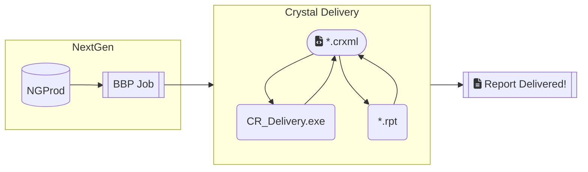

# CR Delivery

## Summary
This application allows delivery of Crystal Reports by either Email or File export either directly, or scheduled through NextGen's Background Business Processor.  
Refer to the [User Guide](https://github.com/kevinfosterNG/CR_Delivery/blob/master/Crystal%20Report%20Delivery%20-%20User%20Guide.pdf) for installation and configuration. 

Here is a simple flow chart:

### CR Delivery (v1.0.13)

  
  <h5 align="center">CR Delivery About

  

  
### NextGen BBP Integration
  

  
  <h5 align="center">NextGen BBP Integration

## Installer Download
[v1.1.3](Setup-1.1.3.msi)

## Supported NextGen versions
_Though most versions are suspected to work as is, these are the specific versions tested against._

| NG Version | Status | CR Delivery Version | CR Runtime |
|:-------:|:------|:------|:------|
| 5.8.3 |  | v1.0.10 (and earlier) | 13.0.14 |
| 5.9.1 |  | v1.0.10 (and earlier) | 13.0.14 |
| 5.9.2 |  | v1.1.2 (and later) | 13.0.24 |
| 5.9.3 |  | v1.1.2 (and later) | 13.0.24 |
| 5.9.2020.1 |  | v1.1.2 (and later) | 13.0.24 |
| 6.2021.1 |  | v1.1.2 (and later) | 13.0.24 |
